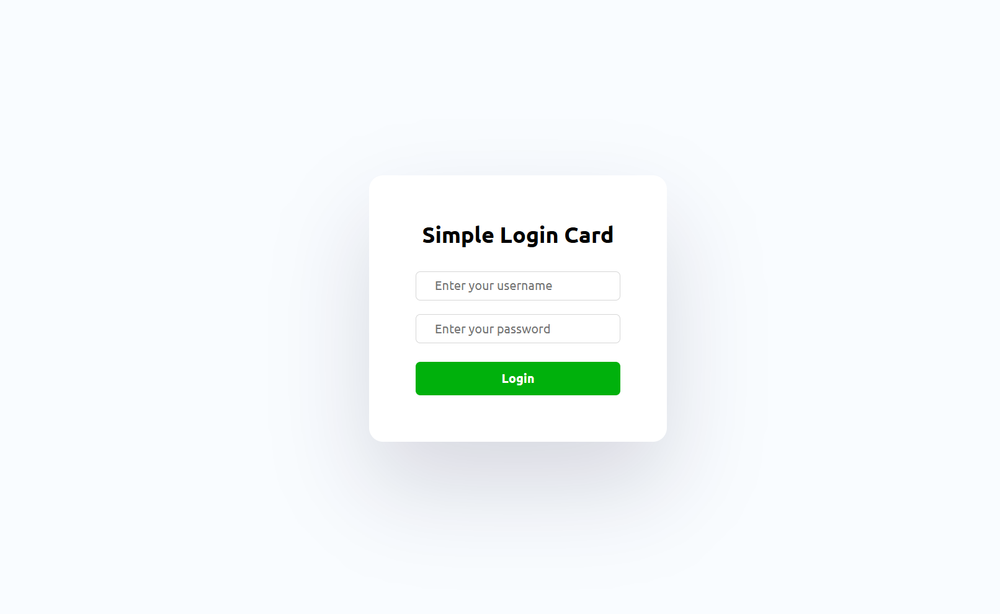

# A Simple Login Card

## Project Overview

### Description

A simple and attractive login card designed with HTML and CSS.

### Screenshots

### Technologies Used

- **Figma** – For creating the initial design and layout.
- **HTML** – Used to structure the card design.
- **CSS** –  Used to style and enhance the card's appearance.

### Learnings & Outcome

- Used HTML tags like `<input>` and `<button>` to structure content.  
- Gained experience with CSS styling, including:  
  - Precisely positioning elements.  
  - Adding colors, fonts, shadows and maintaining a consistent design style.  
  - Creating input fields, buttons, and card components.  

### Connect with Me

Stay connected and explore more of my work:

Thank you for checking out my project! Let’s stay connected and build something amazing. **Happy coding!** 🚀